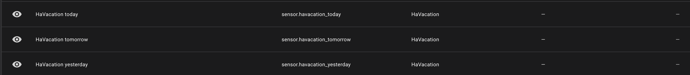
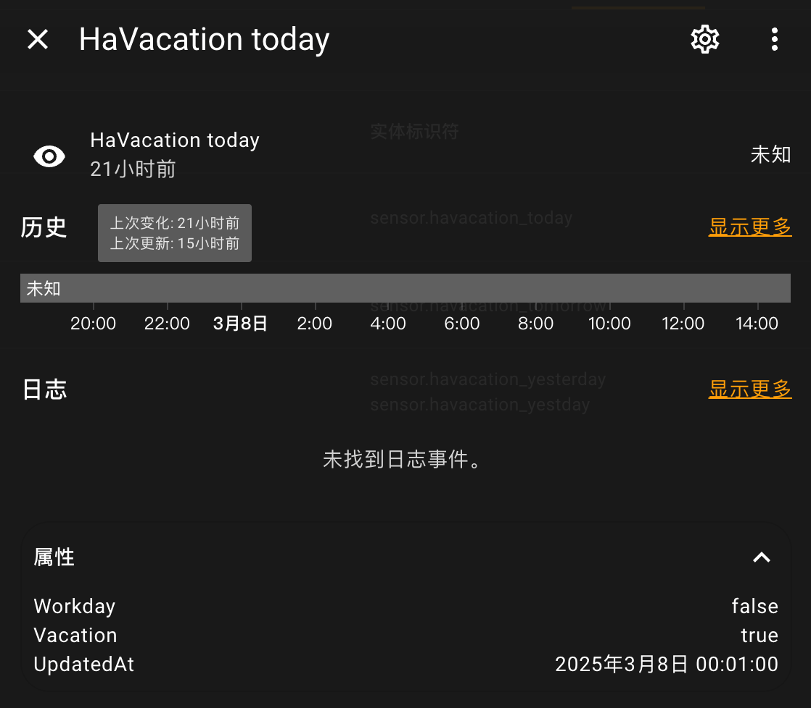

# HaVacation

A Chinese workday/vacation integration for Home-Assistant.

## Installation

Go to [Releases](https://github.com/touero/HaVacation/releases/) download the HaVacation.tar.gz, and move it to `HomeAssistant/custom_components` and execute:

```shell
tar -zxvf ha_vacation.tar.gz
```
And then restart your home-assistant.

In add integration search HaVacation configure it.

## Details

After you will get 1-3 sensor:



And then have attribute:



> [!TIP]
> `IsWorkday` indicates whether it is a working day.  
> `IsVacation` indicates whether it is a holiday.  
> The value of `IsWorkday` and `IsVacation` there will be only two changes: `true` and `false`.  
> UpdatedAt is the sensor update datetime, it will update at every day 00:00.  

Start your automation!

## Maintainers
[@touero](https://github.com/touero)

## Base on

[chinese-calendar](https://github.com/LKI/chinese-calendar)
