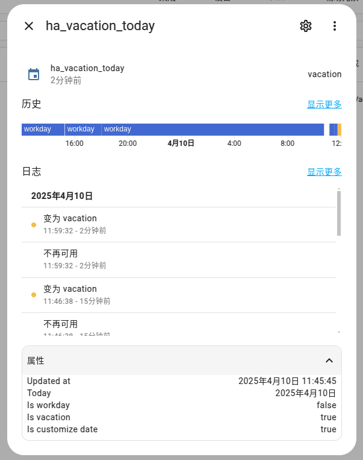

# HaVacation

A Chinese workday/vacation integration for Home-Assistant.

## Installation

Go to Releases download the HaVacation.tar.gz, and move it to `HomeAssistant/custom_components` and execute:

```shell
tar -zxvf HaVacation.tar.gz
```
And then restart your home-assistant.

In add integration search HaVacation configure it it.

## Details

After you will get 1-3 sensor:


And then have attribute:



> [!TIP]
> `Workday` indicates whether it is a working day.  
> `Vacation` indicates whether it is a holiday.  
> The value of `Workday` and `Vacation` there will be only two changes: `true` and `false`.  
> First add integration UpdatedAt is `init`, it will update in everyday 00:01.  

Start your automation!

## Maintainers
[@touero](https://github.com/touero)

## Base on

[chinese-calendar](https://github.com/LKI/chinese-calendar)
